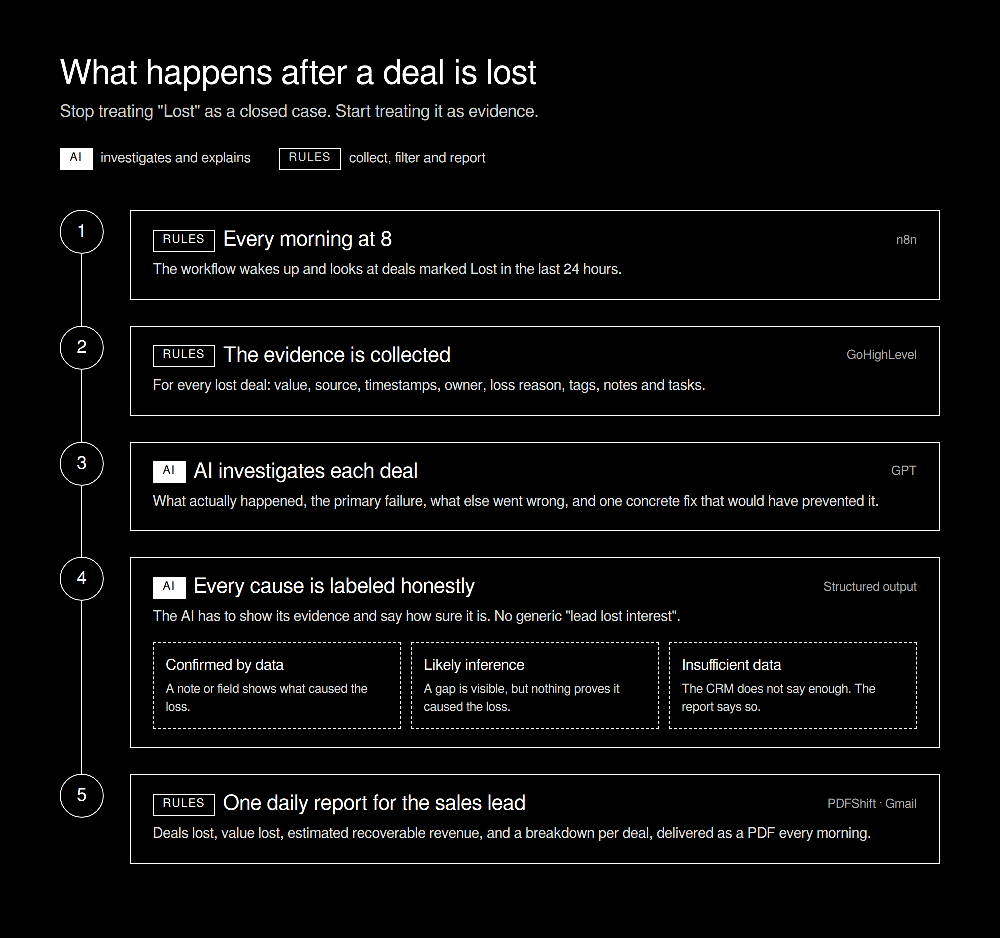
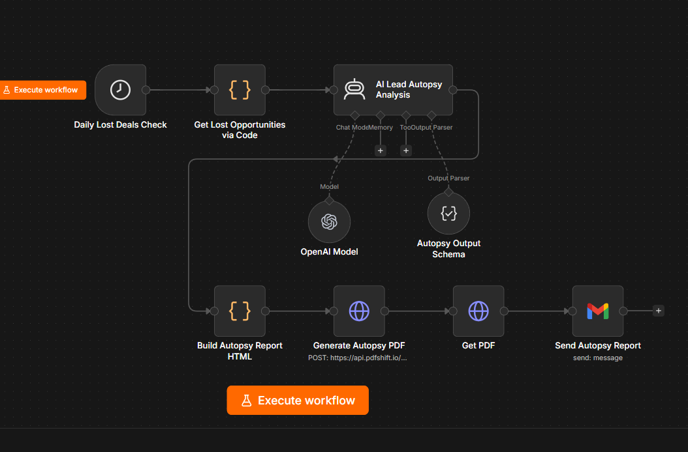
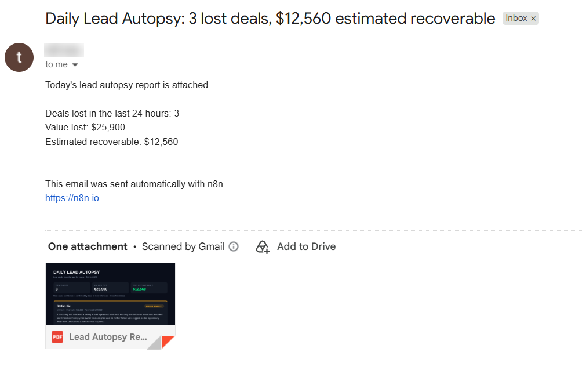
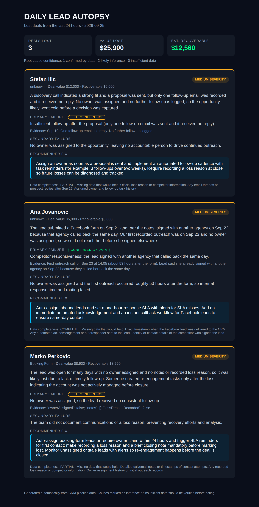
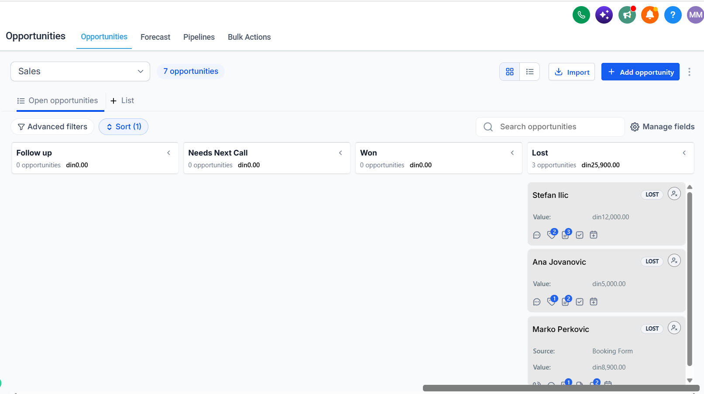
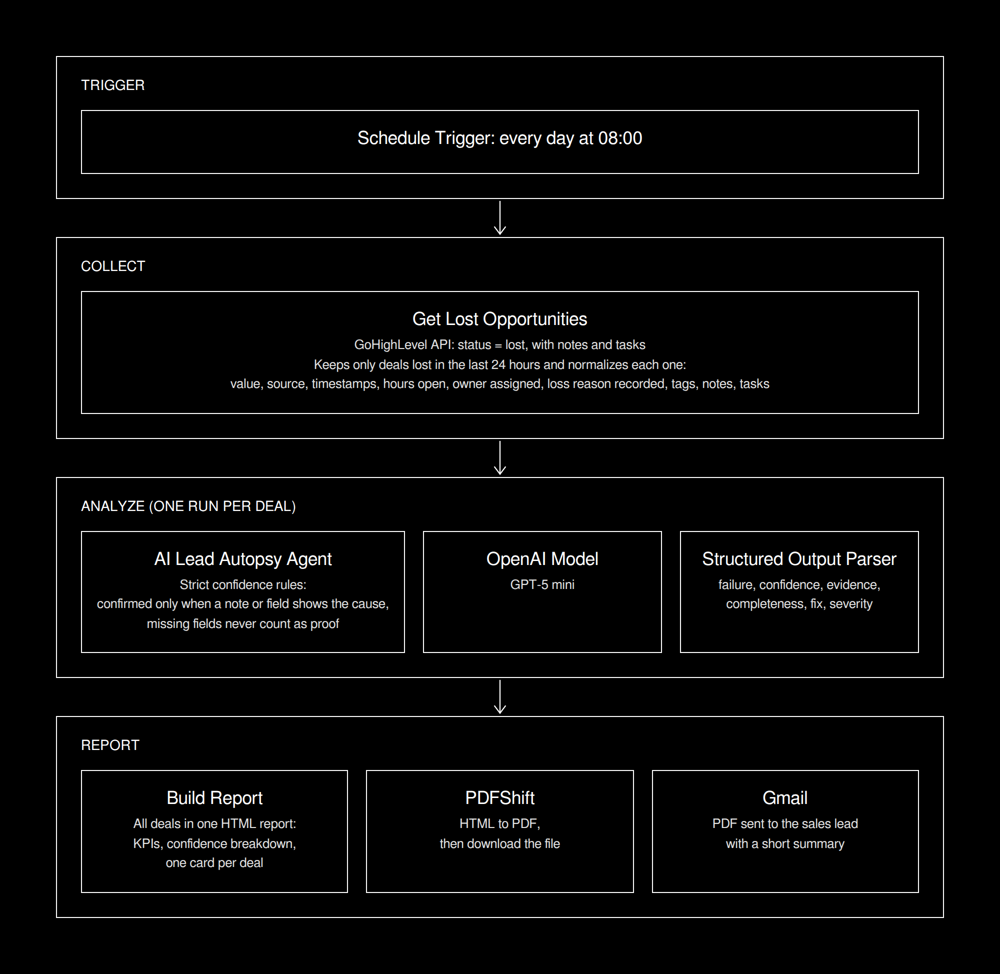

# AI Lead Autopsy

An n8n workflow that investigates every lost deal in GoHighLevel, explains what actually went wrong, labels how certain that explanation is, and sends the sales lead one daily PDF report.

> **Stop treating "Lost" as a closed case. Start treating it as evidence.**

Built with **n8n, GoHighLevel, GPT, PDFShift, and Gmail.**



---

## The Problem

When an opportunity moves to "Lost", the story usually ends there.

The CRM often already holds the answer: timestamps, notes, missing owners, skipped follow-ups. But nobody has time to go back through every lost deal, so the same mistakes repeat:

* Leads wait too long for a first response
* Deals sit without an owner
* Proposals go out with no real follow-up
* Loss reasons are never recorded
* "Lead lost interest" becomes the default explanation

---

## What This System Does

Every morning, the workflow:

1. Finds every deal marked Lost in the last 24 hours
2. Collects the evidence: value, source, timestamps, owner, loss reason, tags, notes and tasks
3. Has AI investigate each deal and name the primary and secondary failure
4. Forces the AI to show its evidence and label its confidence
5. Recommends one concrete fix per deal
6. Builds one daily PDF report and emails it to the sales lead

---

## See It in Action

### 1. The Workflow

Every morning at 8, n8n collects the lost deals, analyzes each one and builds the report.



### 2. The Email

The sales lead gets one email with the key numbers and the full report attached.



### 3. The Report

The PDF ([`sample_report.pdf`](sample_report.pdf)) starts with the numbers that matter: deals lost, value lost and estimated recoverable revenue. Then every deal gets its own breakdown:

* **What happened:** a short factual account
* **Primary failure:** the main reason the deal was lost, with a confidence label
* **Evidence:** the exact note or field behind the conclusion
* **Secondary failure:** what else went wrong
* **Recommended fix:** one process or automation change that would prevent it
* **Data completeness:** and which missing data would make the answer more certain



### 4. The Lost Deals in GoHighLevel

These are the three lost deals from the test run. The report above was generated from them.



---

## Honest by Design

The AI isn't the impressive part. The honesty is.

A generic AI summary would give every lost deal a confident explanation. This workflow does not allow that. Every primary failure carries one of three labels:

| Label                 | Meaning                                                              |
| --------------------- | -------------------------------------------------------------------- |
| **Confirmed by data** | A note or field shows what caused the loss                           |
| **Likely inference**  | The data shows a gap, but nothing proves the gap caused the loss     |
| **Insufficient data** | The CRM does not say enough, and the report says so plainly          |

Missing fields alone, like no owner or no loss reason, never count as proof. They show up as secondary failures or as data the team should start recording.

In the test run behind the sample report, the workflow produced one confirmed cause and two likely inferences, instead of three confident guesses.

---

## How It Works

### 1. Collect

A scheduled n8n workflow calls the GoHighLevel API for lost opportunities, including their notes and tasks, keeps only the ones lost in the last 24 hours, and turns each deal into a clean evidence record ([`sample_lost_deal.json`](sample_lost_deal.json)).

### 2. Analyze

An AI agent reviews one deal at a time. A structured output parser makes sure every answer has the same fields: failure, confidence, evidence, completeness, fix and severity ([`sample_autopsy.json`](sample_autopsy.json)).

### 3. Report

All analyses are combined into one HTML report, converted to PDF with PDFShift, and emailed to the sales lead.

---

## Architecture



---

## Example

Input (shortened):

```json
{
  "leadName": "Jane Doe",
  "value": 5000,
  "source": "Facebook Lead Form",
  "ownerAssigned": false,
  "notes": [
    { "text": "First outreach call about 53 hours after the form. Lead said she already signed with another agency because they called her back the same day." }
  ]
}
```

Output (shortened):

```json
{
  "primaryFailure": "Slow first response: a competitor reached the lead first.",
  "primaryFailureConfidence": "CONFIRMED_BY_DATA",
  "secondaryFailure": "No owner was assigned, so nobody was accountable for the first call.",
  "recommendedFix": "Auto-assign inbound leads on creation and enforce a 15-minute first-call task with escalation if it is missed.",
  "estimatedRecoverableRevenue": 3000
}
```

---

## Design Decisions

* **Evidence over opinions.** Every conclusion points to the note or field it came from.
* **Confidence is part of the answer.** A likely cause is never presented as a confirmed one.
* **Only new losses.** Each deal is analyzed once, on the morning after it was lost.
* **One report, not one email per deal.** The sales lead gets a single daily view.
* **Fixes, not blame.** Every autopsy ends with a process change, not a person to blame.

---

## Limitations

* The analysis is only as good as what the team logs in the CRM
* Recoverable revenue is an estimate, not a measured number
* Calls and emails that are not logged in the CRM are invisible to the workflow
* Causes marked as inference should be checked before acting on them

---

## Tech Stack

| Tool            | Role                                          |
| --------------- | --------------------------------------------- |
| **n8n**         | Scheduling, data collection and orchestration |
| **GoHighLevel** | Lost opportunities, notes, tasks and tags     |
| **GPT**         | Deal analysis with structured output          |
| **PDFShift**    | HTML to PDF report                            |
| **Gmail**       | Daily report delivery                         |

---

## Project Structure

```text
AI-Lead-Autopsy/
│
├── screenshots/
│   ├── n8n_workflow.png
│   ├── email_report.png
│   ├── sample_report.png
│   └── ghl_lost_deals.png
│
├── lead_autopsy_overview.png     # client-friendly overview
├── lead_autopsy_technical.png    # technical flow
├── sample_report.pdf             # real report from the test run
├── sample_lost_deal.json         # evidence record for one lost deal
├── sample_autopsy.json           # AI autopsy for the same deal
└── README.md
```

---

## About

Built as a portfolio project focused on practical sales automation with n8n, CRM data, structured AI outputs, and honest reporting.

Works with GoHighLevel out of the box, and the same approach applies to HubSpot, Salesforce or any CRM with an API.
